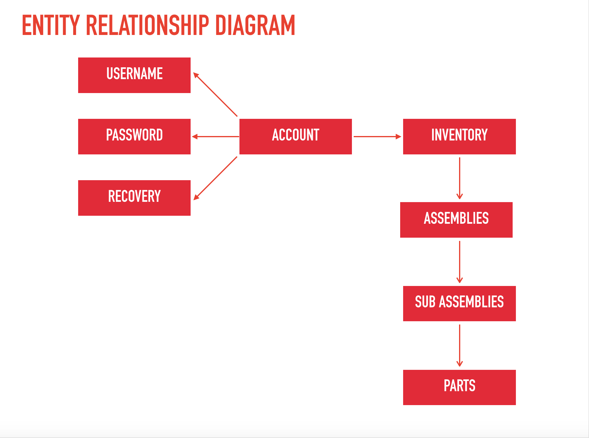

# ***Back End Repository***
- If you're looking for the front end respository, click [HERE](https://github.com/fncreative/FlySorter-front-end)
# Build Status
# Description
- An inventory management application for the Seattle-based company Fly-Sorter. Fly Sorter builds
machines to sort fruit flies so they can be used for scientific research. This application keeps track of those machine assemblies, sub-assemblies, and the parts that belong to those
sub assemblies. These components are displayed on the page and allows the user to click
on a sub-assembly to reveal the parts that makeup that sub-assembly.
The table also allows the user to filter parts and search for a part in order to make finding particular parts faster and easier for the user.

# Languages, Technologies, Frameworks, & Libraries Used (backend)

1. NodeJS
2. Express for server routing
3. MongoDB for database management
4. Jest for testing
5. JSON Web Token for bearer user authentication
6. Bcrypt for password hashing
7. Artillery for load testing
8. Faker
9. Eslint
10. Cors
11. Superagent
12. Winston

# Running the application

- To run the application locally, follow these steps:
1. Turn on the database by executing the ```npm run dbOn``` command in your terminal.
2. In a new terminal window, start the server by entering the ```npm run start``` command in your terminal.
     - If done correctly, the following message should appear in your terminal: 
     
        ```info: Server is on at PORT: <portNumber>```

# Testing

- Backend testing of this application is done via Jest testing, in order to test
the application...

1. Fork this repository on Github.
2. Clone the repository to your local machine using the ```git clone``` command in your terminal.
3. Install all required dependencies by entering the ```npm i``` command in your terminal.
4. Turn on the database by executing the ```npm run dbOn``` command in your terminal.
5. Start the test suite by executing the ```npm run test``` command in your terminal.




___
***Authors: [Benjamin West](https://github.com/bgwest) | | [Daniel Frey](https://github.com/fncreative) | | [Tom North](https://github.com/tnorth93) | | [Wyatt Pefley](https://github.com/peffles)***
____


